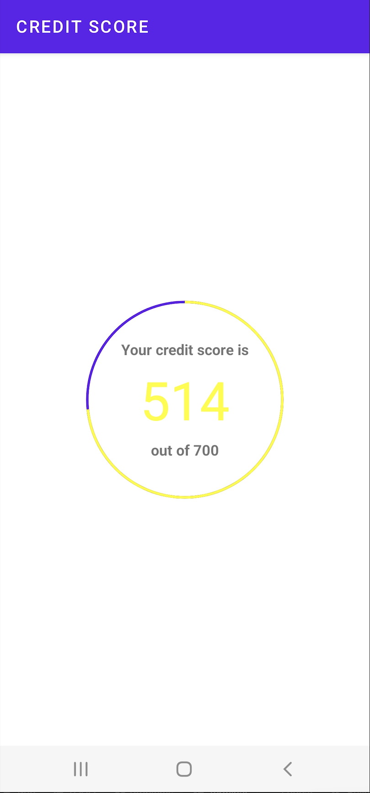
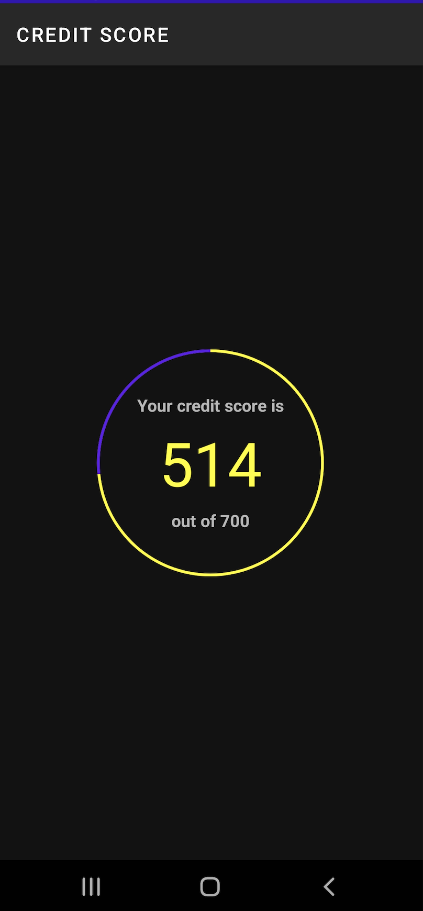

# CreditScore

This application simply retrieves credit score information from a specified endpoint and displays the data in a donut view.

Please find below more details...

## Clean architecture with 3 layers
- Data (for database, API and preferences code)
- Domain (for business logic and models)
- Presentation/App (for UI logic, with [MVI](https://www.raywenderlich.com/817602-mvi-architecture-for-android-tutorial-getting-started))

## Tests
- Unit tests
- Application tests
- Activity tests (with [Espresso](https://google.github.io/android-testing-support-library/docs/espresso/))

## Other useful features
- Dependency injection (with [Hilt](http://google.github.io/hilt/))
- Reactive programming with [RXJAVA](https://reactivex.io/)
- Google [Material Design](https://material.io/blog/android-material-theme-color) library
- Quick cached Image loading (with [Picasso](https://square.github.io/picasso/))
- Networking (with [Retrofit](https://square.github.io/retrofit/))
- Flat layout hierarchy (with [Constraint layouts](https://developer.android.com/jetpack/androidx/releases/constraintlayout))
- Multi Screen Segmentation (with [Fragments](https://developer.android.com/jetpack/androidx/releases/fragment))
- Navigation (with [Navigation Library](https://developer.android.com/guide/navigation/navigation-migrate))
- Android lifecycle aware components (with [Lifecycle](https://developer.android.com/jetpack/androidx/releases/lifecycle))
- Data surviving configuration changes (with [ViewModel](https://developer.android.com/topic/libraries/architecture/viewmodel))
- Type safe dependency management (with [Kotlin DSL](https://kotlinlang.org/docs/type-safe-builders.html))
- Android architecture components to share ViewModels during configuration changes

| Light Theme | Dark Theme |
|----------------------------| --------------------------- |
|  |  | 

# Getting started

### Script
1. Clone this repository preferably with Android Studio
2. Build project and then run application. In the situation where you are asked about trusting the application please do select *yes*
3. Please make sure you are on the `main` branch as that has all the latest changes.

# Future Improvements
- Implement composable UI with donut view.
- Add more instrumentation tests to support data states
- Add more unit tests as well
- Go further with modularising the application
- Include offline support
- Automatically retry endpoint once network is restored
- Avoid credit Score fragment from reloading
- Improve credit score detail screen UI (could be a card view with a recycler view) 

# Issues faced
- Has issues with donut view as I wanted to avoid using libraries.
- I had a bit of trouble understanding what data elements were relevant for the donut view.

